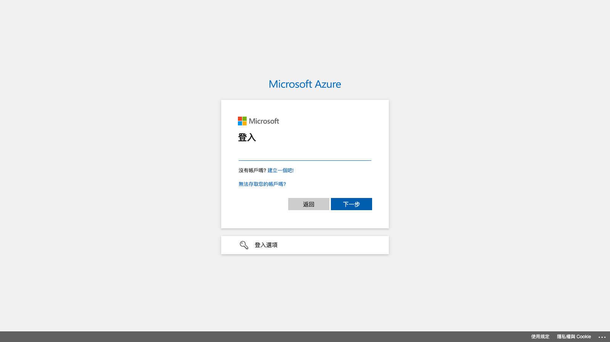
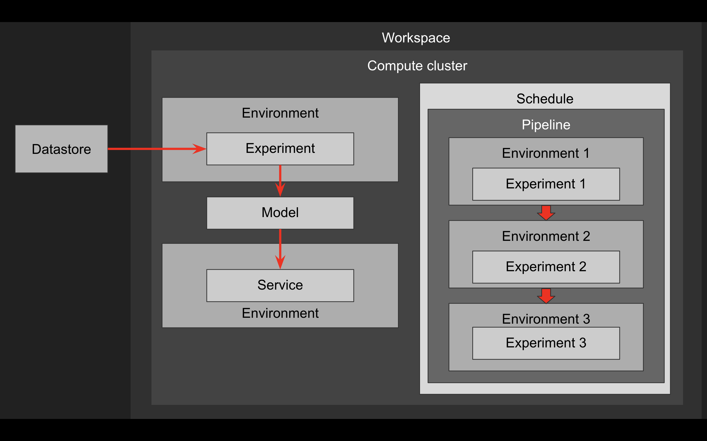
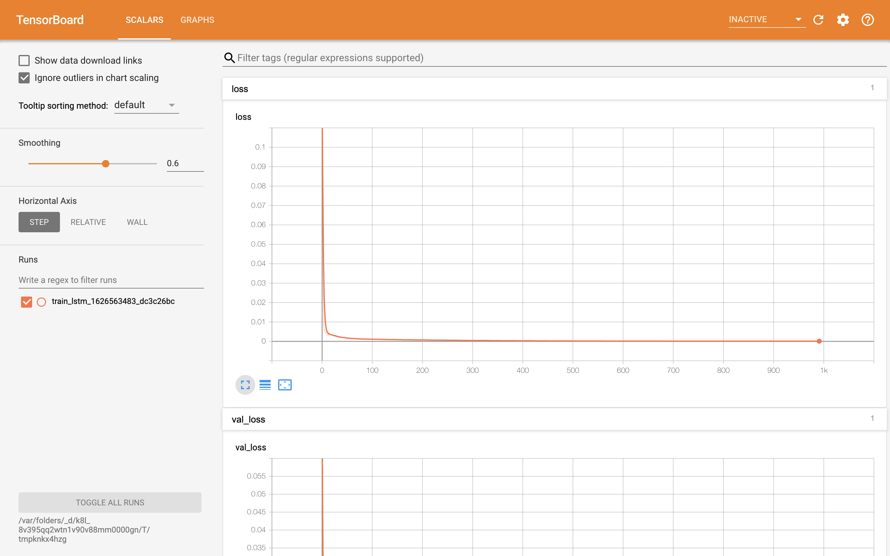

# Azure Machine Learning Advance
## Do All the things with Python

---

<!-- .slide: data-background="media/Ben.png" -->

---

## Outline

- Azure Pass
- 事前準備
- 從零開始到部署服務
- 參考資料

---

## Azure Pass

- 取得 Azure Pass
  - 進入 https://checkin.globalai.community/
  - 填寫姓名和 email
  - 收信並點擊連結
  - 輸入 Event code
- 開始使用 Azure Pass
  - https://www.microsoftazurepass.com/
  - Start

---

# 事前準備


----

## Azure CLI 安裝

- 官方文件：
  - https://docs.microsoft.com/zh-tw/cli/azure/install-azure-cli
- Mac
```
brew update && brew install azure-cli
```
- Windows
  - https://aka.ms/installazurecliwindows

----

## Azure CLI 安裝

- Ubuntu

```bash
# 更新並安裝必要的套件
sudo apt-get update
sudo apt-get install ca-certificates \
curl apt-transport-https lsb-release gnupg

# 下載並安裝Microsoft signing key
curl -sL https://packages.microsoft.com/keys/microsoft.asc |
    gpg --dearmor |
    sudo tee /etc/apt/trusted.gpg.d/microsoft.gpg > /dev/null
```
----

- Ubuntu

```bash

# 新增Azure CLI software repository
AZ_REPO=$(lsb_release -cs)
echo "deb [arch=amd64] https://packages.microsoft.com/repos/azure-cli/ $AZ_REPO main" |
    sudo tee /etc/apt/sources.list.d/azure-cli.list

# 再次更新並安裝azure-cli
sudo apt-get update
sudo apt-get install azure-cli
```

----

## 登入 Azure

```
az login
```
- <font color=yellow>The default web browser has been opened at https://login.microsoftonline.com/common/oauth2/authorize. Please continue the login in the web browser. If no web browser is available or if the web browser fails to open, use device code flow with </font>

```
az login --use-device-code
```

----




----

### 安裝`Python`套件

請在本地端安裝
```bash
# Azure Machine Learning 基本套件
pip3.7 install azureml-core

# 為了取得資料
pip3.7 install investpy
pip3.7 install scikit-learn

# 結合 Azure 和 Tensorboard 的套件
pip3.7 install azureml-tensorboard
```

----

### Clone repository

```
git clone https://github.com/KuiMing/triathlon_azure
```


---

                    
## Azure machine learning

- 建立工作區 
- 建立運算群組 
- 上傳檔案
- 執行實驗
  - 訓練模型
  - 註冊模型
- 部署服務
- 使用預測服務
- Pipeline
- 排程

----



----

以上流程，很像某個龜毛人在買雞排～～～

----

<!-- .slide: data-auto-animate -->


- 我等等帶烏骨雞過去<!-- .element: class="fragment" data-fragment-index="1" -->
- 幫我切出雞排重量至少200公克<!-- .element: class="fragment" data-fragment-index="2" -->
- 雞排要用胡椒粉醃過24小時<!-- .element: class="fragment" data-fragment-index="3" -->
- 油溫 170°C<!-- .element: class="fragment" data-fragment-index="4" -->
- 油炸三分鐘<!-- .element: class="fragment" data-fragment-index="5" -->
- 瀝油五分鐘<!-- .element: class="fragment" data-fragment-index="6" -->
- 切成25塊<!-- .element: class="fragment" data-fragment-index="7" -->
- 胡椒粉跟辣椒粉各撒一次<!-- .element: class="fragment" data-fragment-index="8" -->
- 放兩根竹籤，全程錄影紀錄<!-- .element: class="fragment" data-fragment-index="9" -->

----

<!-- .slide: data-auto-animate -->


- ~~神經喔！無愛來茲亂啦~~<br><!-- .element: class="fragment" data-fragment-index="1" -->
- <font color='red'>好的，重複你的餐點～～</font><!-- .element: class="fragment" data-fragment-index="2" -->
- 雞的品種要烏骨雞<!-- .element: class="fragment" data-fragment-index="3" -->
- 雞排重量至少200公克<!-- .element: class="fragment" data-fragment-index="3" -->
- 雞排要用胡椒粉醃過24小時<!-- .element: class="fragment" data-fragment-index="3" -->
- 油溫 170°C<!-- .element: class="fragment" data-fragment-index="3" -->
- 油炸三分鐘<!-- .element: class="fragment" data-fragment-index="3" -->
- 瀝油五分鐘<!-- .element: class="fragment" data-fragment-index="3" -->
- 切成25塊<!-- .element: class="fragment" data-fragment-index="3" -->
- 胡椒粉跟辣椒粉各撒一次<!-- .element: class="fragment" data-fragment-index="3" -->
- 放兩根竹籤，全程錄影紀錄<!-- .element: class="fragment" data-fragment-index="3" -->


---

# 從零開始到部署服務 

- Work Space
- Computer Target
- Upload Data
- Environment
- Training Experiment & Register Model
- Deploy Service & Inference

----


### 取得各種 ID

- 執行以下指令，取得 Subscription ID 和 Tenant ID

```
az account list
```


```bash
export TENANT_ID=YOUR TENANT ID
export SUBSCRIPTION_ID=YOUR Subscription ID
```           
---

## Work Space

#### 建立 Azure Machine Learning 的服務

----
<br>
<br>
<br>
<br>
<br>
<br>


- 如果已經建立 <font color='red'>Azure Machine Learning</font>，到首頁下載 `config.json`
- 在自己電腦上的 `triathlon_azure/azure_machine_learning`，建立資料夾 `.azureml`
- 將 `config.json` 放到上述資料夾中
<!-- .slide: data-background-color="#ffffff" data-background="media/ml_34.png" -->


----

## 建立工作區 

`create_workspace.py`
```python [6|8-10|11-12|13-17|21-22]
import os
from azureml.core import Workspace
from azureml.core.authentication import InteractiveLoginAuthentication

# 以 Tenant ID 取得權限
interactive_auth = InteractiveLoginAuthentication(tenant_id=os.getenv("TENANT_ID"))

work_space = Workspace.create(
    name="mlBen",  # 工作區名稱
    subscription_id="Your subscription key",  
    resource_group="Ben",  # 資源群組名稱
    create_resource_group=True,
    location="eastus2",  
    # example: 'eastus2', or 'southeastasia'.
    # 執行執行`az account list-locations -o table`
    # 會列出所有區域相對應的代碼
    auth=interactive_auth,
)

# write out the workspace details to the file: 
# .azureml/config.json
work_space.write_config(path=".azureml")

```
        
----
                    
## 建立工作區 


</img>

----

<!-- .slide: data-background-color="#ffffff" data-background="media/ml_34.png" -->

- 到 https://portal.azure.com/#home ，進入機器學習資源的頁面。
- 啟動工作室。

----

# Workspace
<!-- .slide: data-background-color="#ffffff" data-background="media/ml_36.png" -->

---

## Compute Target
                    
----

## 建立運算群組

`create_compute.py`
```python [7-9|18-21|22-23]
import os
from azureml.core import Workspace
from azureml.core.compute import ComputeTarget, AmlCompute
from azureml.core.compute_target import ComputeTargetException
from azureml.core.authentication import InteractiveLoginAuthentication

# 建立工作區後，可以從 .azureml/config.json 讀取工作區資訊
interactive_auth = InteractiveLoginAuthentication(tenant_id=os.getenv("TENANT_ID"))
work_space = Workspace.from_config(auth=interactive_auth)
# 確認計算叢集是否存在，否則直接建立計算叢集
# 建立計算叢集之後，可以直接用計算叢集的名稱指定執行實驗時的計算叢集
cpu_cluster_name = "cpu-cluster"
try:
    cpu_cluster = ComputeTarget(
      workspace=work_space, name=cpu_cluster_name)
    print("Found existing cluster, use it.")
except ComputeTargetException:
    compute_config = AmlCompute.provisioning_configuration(
        vm_size="STANDARD_D2_V2", max_nodes=4, 
        idle_seconds_before_scaledown=2400
    )
    cpu_cluster = ComputeTarget.create(
      work_space, cpu_cluster_name, compute_config)
cpu_cluster.wait_for_completion(show_output=True)

```

[VM 代號](https://docs.microsoft.com/zh-tw/azure/cloud-services/cloud-services-sizes-specs#dv2-series) 

----

計算叢集


<!-- .slide: data-background-color="#ffffff" data-background="media/ml_10.png" -->

---

## Upload data

----

## 以台幣-美金匯率為例

- [investing.com](https://investing.com)
  - 匯率、債券、憑證、期貨、指數和股票
  - 有 `Python` 套件可以使用


----

### 準備匯率資料

```python [12-18|22]
from datetime import datetime
import os
import pickle
import investpy
from sklearn.preprocessing import MinMaxScaler


# 準備一個名叫 currency 的資料夾
if not os.path.isdir("currency"):
    os.system("mkdir currency")

# 從 investing.com 取得臺幣與美金的歷史匯率
# 取得每天的開盤價、最高價、最低價和收盤價
# 設定一個夠古老的日期，西元1900年01月01日開始
usd_twd = investpy.get_currency_cross_historical_data(
    "USD/TWD",
    from_date="01/01/1900", 
    to_date=datetime.now().strftime("%d/%m/%Y"),
)
# 拿到的資料是 pandas DataFrame，所以可以使用 pandas 的功能
usd_twd.reset_index(inplace=True)
usd_twd.to_csv("currency/usd_twd.csv", index=False)
# 將每天的收盤價作 normalization 調整成 0 ~ 1 之間，即 (x - min(x)) / (max(x) - min(x))
currency_data = usd_twd.Close.values.reshape(-1, 1)
scaler = MinMaxScaler(feature_range=(0, 1))
scaler.transform(currency_data)
# 將 scaler 存成 pickle 檔，方便之後使用
with open("currency/scaler.pickle", "wb") as f_h:
    pickle.dump(scaler, f_h)
f_h.close()

# 先取 2010/01/01 至 2020/12/31 的資料作為訓練資料
currency_data = usd_twd[
    (usd_twd.Date >= "2010-01-01") & (usd_twd.Date < "2021-01-01")
]
# 把資料存成 csv 檔，放到 currency 資料夾
currency_data.to_csv("currency/training_data.csv")
```

----

`upload_file.py`

```python [35-42|43-46]
"""
Upload data to Azure machine learning
"""
import os
import argparse
from azureml.core import Workspace, Dataset
from azureml.core.authentication import InteractiveLoginAuthentication


# 為了方便可以重複使用，上傳不同的資料，所以用 command-line 帶入參數執行
# folder：本地端的資料夾，內含欲上傳資料
# target_folder：替上傳到 datastore 後的資料夾命名
# dataname：為上傳的資料集命名，會顯示在 workspace 的資料頁面中
def parse_args():
    """
    Parse arguments
    """
    parser = argparse.ArgumentParser()
    parser.add_argument("-f", "--folder", help="file folder", type=str)
    parser.add_argument(
        "-t", "--target_folder", help="file folder in datastore", type=str
    )
    parser.add_argument("-n", "--dataname", help="name of dataset", type=str)
    args = parser.parse_args()
    return args


def main():
    """
    Upload data to Azure machine learning
    """
    args = parse_args()
    interactive_auth = InteractiveLoginAuthentication(tenant_id=os.getenv("TENANT_ID"))
    work_space = Workspace.from_config(auth=interactive_auth)
    # workspace 有預設的 datastore，把資料存在預設的 datastore
    datastore = work_space.get_default_datastore()
    # 上傳資料
    datastore.upload(
        src_dir=args.folder,
        target_path=args.target_folder,
        overwrite=True
    )
    # 上傳資料之後，從 datastore 取得資料所在的資料夾，並將資料集註冊
    dataset = Dataset.File.from_files(
        path=(datastore, args.target_folder))
    dataset.register(work_space, name=args.dataname)


if __name__ == "__main__":
    main()
```

----

取得匯率資料，也準備好`upload_file.py`，就可以直接在 terminal 執行，上傳資料
```bash
python3.7 upload_file.py \
--folder currency \
--target_path currency \
--dataname currency
```

----
<br>
<br>

從相對路徑`currency`，上傳到 datastore 的`currency`資料夾，註冊資料集的名稱也為 currency。

<!-- .slide: data-background-color="#ffffff" data-background="media/ml_16.png" -->

----

點進瀏覽，也就能看到已經上傳的各個檔案了。


---

## Environment

----

## 為了大幅節省時間

- 事先準備好環境
- 只會在第一次執行實驗時，建立 docker image

----

### 設定環境

`create_environment.py`
```python [16-23]
"""
Create and register the environment
"""
import os
from azureml.core import Workspace, Environment
from azureml.core.authentication import InteractiveLoginAuthentication


def main():
    """
    Create and register the environment
    """
    interactive_auth = InteractiveLoginAuthentication(tenant_id=os.getenv("TENANT_ID"))
    work_space = Workspace.from_config(auth=interactive_auth)

    # 把需要的套件寫進 requirements.txt
    environment = Environment.from_pip_requirements(
        name="train_lstm", file_path="requirements.txt"
    )
    # 設定 python 版本
    environment.python.conda_dependencies.set_python_version("3.7.7")
    # 最後註冊環境，以便後續使用
    environment.register(work_space)


if __name__ == "__main__":
    main()

```

----

### 鎖定套件版本


`requirements.txt`
```
numpy
scikit-learn==0.23.2
pandas
tensorflow==1.13.1
Keras==2.2.4
azureml-defaults
investpy
h5py==2.10.0

```

----


<!-- .slide: data-background-color="#ffffff" data-background="media/ml_18.png" -->

註冊完之後，可以從環境的頁面看到自訂環境內，有剛剛註冊完的環境


----

- 環境被註冊之後，就可以透過以下作法取得

```python
environment = work_space.environments["train_lstm"]
```


----

<!-- .slide: data-background-color="#ffffff" data-background="media/ml_19.png" -->

## Curated Environment

Azure 預設環境

----

## Curated Environment

```python
from azureml.core import Workspace, Environment
from azureml.core.authentication import InteractiveLoginAuthentication

interactive_auth = InteractiveLoginAuthentication(tenant_id=os.getenv("TENANT_ID"))
work_space = Workspace.from_config(auth=interactive_auth)
env = Environment.get(
    workspace=work_space, 
    name="AzureML-tensorflow-2.4-ubuntu18.04-py37-cpu-inference")

```

----

## docker image


- 也可以直接拿現成的 docker image 作為實驗的環境，這樣也可以事先在本地端測試，確保環境沒有問題。

```python

from azureml.core import Environment

environment = Environment("my_env")
environment.docker.enabled = True
environment.docker.base_image = "mcr.microsoft.com/azureml/intelmpi2018.3-ubuntu16.04:20210301.v1"

```

- Azure 也有提供一些已經事先準備好的 [docker image](https://docs.microsoft.com/en-us/azure/machine-learning/concept-prebuilt-docker-images-inference#list-of-prebuilt-docker-images-for-inference)，可以直接拿來設定環境。


---

## training experiment and register model

### 以 LSTM 模型為例

----

## 在`workspace`訓練模型

  1. 在`workspace`利用計算叢集執行的程式碼：`train_lstm.py`，其主要任務為訓練模型，應該考慮的步驟如下：
      - 取得資料
      - 整理資料
      - 建構模型
      - 訓練模型
      - 輸出模型與訓練結果

----

## 在`workspace`訓練模型

  2.  `run_experiment_training.py` 在本機執行
      - 上傳`train_lstm.py`
      - 通知`workspace`開始執行`train_lstm.py`
      - 註冊模型
      - 利用`tensorboard`觀察訓練過程中的各項數值


----


### 在 `workspce` 執行


`train_lstm.py`
```python [62|81|101-109|112-113]
import argparse
import os
import pickle
import numpy as np
from azureml.core.run import Run
from azureml.core.model import Model
import pandas as pd
from keras.models import Sequential, load_model
from keras.layers import Dense, LSTM, Dropout
from keras.preprocessing.sequence import TimeseriesGenerator
from keras.callbacks import TensorBoard


# 產生 training data 和 validation data
def data_generator(data, data_len=240):
    """
    generate data for training and validation
    """
    generator = TimeseriesGenerator(
        data=data, targets=range(data.shape[0]), length=data_len, batch_size=1, stride=1
    )
    x_all = []
    for i in generator:
        x_all.append(i[0][0])
    x_all = np.array(x_all)
    y_all = data[range(data_len, len(x_all) + data_len)]
    # 資料的前面六成作為訓練之用，後面時間較新的四成資料作為驗證之用
    rate = 0.4
    x_train = x_all[: int(len(x_all) * (1 - rate))]
    y_train = y_all[: int(y_all.shape[0] * (1 - rate))]
    x_val = x_all[int(len(x_all) * (1 - rate)) :]
    y_val = y_all[int(y_all.shape[0] * (1 - rate)) :]
    return x_train, y_train, x_val, y_val


def parse_args():
    """
    Parse arguments
    """
    parser = argparse.ArgumentParser()
    parser.add_argument("--target_folder", type=str, help="Path to the training data")
    parser.add_argument(
        "--experiment",
        type=bool,
        default=False,
        help="Just run an experiment, there is no pipeline",
    )
    # 此處的 log folder 是為了使用 tensorboard ，在 workspace 之中訓練時的相對路徑，儲存訓練過程中的觀察數值
    parser.add_argument(
        "--log_folder", type=str, help="Path to the log", default="./logs"
    )
    args = parser.parse_args()
    return args


def main():
    """
    Training of LeNet with keras
    """
    args = parse_args()
    run = Run.get_context() # 取得目前的服務內容
    # 從 datastore 讀取資料，並且加以整理
    usd_twd = pd.read_csv(os.path.join(args.target_folder, "training_data.csv"))
    data = usd_twd.Close.values.reshape(-1, 1)
    with open(os.path.join(args.target_folder, "scaler.pickle"), "rb") as f_h:
        scaler = pickle.load(f_h)
    f_h.close()
    data = scaler.transform(data)
    data_len = 240
    x_train, y_train, x_val, y_val = data_generator(data, data_len)
    # 這裡留一個伏筆，之後還需要考慮到 pipeline 的情況，在使用 pipeline 的時候部分步驟會省略
    if args.experiment:
    # 模型很簡單，LSTM 後，就接 dropout，最後再加一層 full connected network 就直接輸出了
        model = Sequential()
        model.add(LSTM(16, input_shape=(data_len, 1)))
        model.add(Dropout(0.1))
        model.add(Dense(1))
        model.compile(loss="mse", optimizer="adam")
        # Tensorboard
        callback = TensorBoard(
            log_dir="./logs",
            histogram_freq=0,
            write_graph=True,
            write_images=True,
            embeddings_freq=0,
            embeddings_layer_names=None,
            embeddings_metadata=None,
        )
    # 訓練模型
    history_callback = model.fit(
        x_train,
        y_train,
        epochs=1000,
        batch_size=240,
        verbose=1,
        validation_data=[x_val, y_val],
        callbacks=[callback],
    )

    # 訓練過程中產生的數值，都可以輸出到 workspace ，可以在 workspace 的網頁上看到
    # 可以輸出的資料有上限，資料長度上限是 250，所以不要把所有 loss 都塞進去
    # 另外該注意的是，所有數值必須以 list 的格式輸出
    metrics = history_callback.history
    run.log_list("train_loss", metrics["loss"][:10])
    run.log_list("val_loss", metrics["val_loss"][:10])
    run.log_list("start", [usd_twd.Date.values[0]])
    run.log_list("end", [usd_twd.Date.values[-1]])
    run.log_list("epoch", [len(history_callback.epoch)])

    print("Finished Training")
    # 這邊要非常注意！！！！只能將模型存在 outputs 這個資料夾之下，後續才能註冊模型
    model.save("outputs/keras_lstm.h5")
    print("Saved Model")
    # 順便將 scaler 存檔，以便註冊
    if args.experiment:
        with open("outputs/scaler.pickle", "wb") as f_h:
            pickle.dump(scaler, f_h)
        f_h.close()
    


if __name__ == "__main__":
    main()

```

----

### 在本機執行

`run_experiment_training.py`
```python [31-33|36,38|42-44|52-57|67-75|78-90]
import os
import argparse
from azureml.core import ScriptRunConfig, Dataset, Workspace, Experiment
from azureml.tensorboard import Tensorboard
from azureml.core.authentication import InteractiveLoginAuthentication


def parse_args():
    """
    Parse arguments
    """
    parser = argparse.ArgumentParser()
    # 提供 py 檔
    parser.add_argument("-f", "--file", help="python script", type=str)
    # target_folder 則是需要輸入當初上傳到 Azure 資料夾路徑
    parser.add_argument(
        "-t", "--target_folder", help="file folder in datastore", type=str
    )
    args = parser.parse_args()
    return args


def main():
    """
    Run the experiment for training
    """
    args = parse_args()
    interactive_auth = InteractiveLoginAuthentication(tenant_id=os.getenv("TENANT_ID"))
    work_space = Workspace.from_config(auth=interactive_auth)

    # 從 datastore 取得資料
    datastore = work_space.get_default_datastore()
    dataset = Dataset.File.from_files(path=(datastore, args.target_folder))

    # 設定實驗，名稱可以隨意，這邊是直接以輸入的 py 檔為名
    experiment = Experiment(workspace=work_space, name=args.file.replace(".py", ""))
    # 設定要在 workspace 執行的 py 檔的檔名與路徑，選定運算集群，並且將 py 檔會用到的參數放在 arguments
    config = ScriptRunConfig(
        source_directory=".",
        script=args.file,
        compute_target="cpu-cluster",
        arguments=[
            "--target_folder",
            dataset.as_named_input("input").as_mount(), # 輸入資料集在 datastore 的路徑
            "--experiment",
            True,
            "--log_folder",
            "./logs",
        ],
    )

    # 選擇已經註冊的環境，之前的環境也是以 py 檔的檔名命名
    environment = work_space.environments[args.file.replace(".py", "")]
    config.run_config.environment = environment

    # 開始進行實驗，訓練模型
    run = experiment.submit(config)
    # 取得 URL，透過瀏覽器觀察實驗過程
    aml_url = run.get_portal_url()
    print(
        "Submitted to an Azure Machine Learning compute cluster. Click on the link below"
    )
    print("")
    print(aml_url)


    # 開啟 tensorboard
    tboard = Tensorboard([run])
    # 自動開啟瀏覽器
    tboard.start(start_browser=True)
    run.wait_for_completion(show_output=True)
    # 這邊設定一個緩衝，實驗執行完後，在 terminal 按下 enter ，才會結束 tensorboard
    print("Press enter to stop")
    input()
    tboard.stop()

    # 最後註冊模型，所有模型都必須放到 outputs/ 的路徑之下
    # properties 可以用來記錄跟此模型有關的所有數值
    metrics = run.get_metrics()
    run.register_model(
        model_name=args.target_folder,
        tags={"model": "LSTM"},
        model_path="outputs/keras_lstm.h5",
        model_framework="keras",
        model_framework_version="2.2.4",
        properties={
            "train_loss": metrics["train_loss"][-1],
            "val_loss": metrics["val_loss"][-1],
            "data": "USD/TWD from {0} to {1}".format(metrics["start"], metrics["end"]),
            "epoch": metrics["epoch"],
        },
    )

    run.register_model(
        model_name="scaler",
        tags={"data": "USD/TWD from 1983-10-04", "model": "MinMaxScaler"},
        model_path="outputs/scaler.pickle",
        model_framework="sklearn",
    )


if __name__ == "__main__":
    main()

```

----

### 執行實驗

```bash
python3.7 run_experiment_training.py \
--file train_lstm.py --target_folder currency
```

----

### Tensorboard

 

----


### Tensorboard

 |

----


<!-- .slide: data-background-color="#ffffff" data-background="media/ml_22.png" -->


----


<!-- .slide: data-background-color="#ffffff" data-background="media/ml_24.png" -->

除了在`workspace`上使用模型外，也能下載下來使用。

----

## 訓練效果

              
---

## deploy service and inference

----


### 部署服務

- 部署服務時，一樣需要兩份 py 檔
  1. 一個在`workspace`利用運算群組執行預測服務
  2. 另一個是在本機執行，將預測的服務部署在`workspace`

----

### 部署服務

- 用來執行預測服務的程式碼結構基本上是固定的，必須定義兩個 function：
    - `init`：讀取模型。
    - `run`：當使用者呼叫 API 時，執行預測，並回傳結果。

----

### 在 `workspace` 執行

`predict_currency.py`
```python [8,15-16|23|30|45|47]
import os
from datetime import datetime, timedelta
import pickle
from keras.models import load_model
import investpy


def init():
    """
    Load the model
    """
    global model
    global scaler
    
    # 模型的預設路徑就是 /var/azureml-app/azureml-models/，從中找到相對應的模型
    # 也可以從環境變數 `AZUREML_MODEL_DIR` 取得路徑
    for root, _, files in os.walk("/var/azureml-app/azureml-models/", topdown=False):
        for name in files:
            if name.split(".")[-1] == "h5":
                model_path = os.path.join(root, name)
            elif name.split(".")[-1] == "pickle":
                scaler_path = os.path.join(root, name)
    model = load_model(model_path)
    with open(scaler_path, "rb") as f_h:
        scaler = pickle.load(f_h)
    f_h.close()

# 這邊的 raw_data 並沒有被使用到，因為資料可以直接透過 investpy 取得。
# 但因為直接省略 raw_data ，是無法部署的，所以只好保留。
def run(raw_data):
    """
    Prediction
    """
    
    today = datetime.now()
    data = investpy.get_currency_cross_historical_data(
        "USD/TWD",
        from_date=(today - timedelta(weeks=105)).strftime("%d/%m/%Y"),
        to_date=today.strftime("%d/%m/%Y"),
    )
    data.reset_index(inplace=True)
    data = data.tail(240).Close.values.reshape(-1, 1)
    data = scaler.transform(data)
    data = data.reshape((1, 240, 1))
    ans = model.predict(data)
    ans = scaler.inverse_transform(ans)
    # 要注意回傳的數值必須要是 JSON 支援的資料格式
    return float(ans[0][0])
```
----

### 注意事項
- 部署服務時，需要考慮執行環境，如果沒有事先準備好現成的環境，服務部屬的時間會非常久，因為會從環境準備開始。
- 需要指定模型，包含版本和名稱，這樣 `workspace` 才找得到相對應的模型。

----

### 在本機執行

`deploy_currency_prediction.py`
```python [23-27|31-35|37-38|39-47]
import os
import numpy as np
from azureml.core import Model, Workspace
from azureml.core import Run
from azureml.core.model import InferenceConfig
from azureml.core.webservice import AciWebservice
from azureml.core.authentication import InteractiveLoginAuthentication


def main():
    """
    Deploy model to your service
    """
    # 為了之後 pipeline 的使用，所以使用兩種方式取得 workspace。
    run = Run.get_context()
    try:
        work_space = run.experiment.workspace
    except AttributeError:
        interactive_auth = InteractiveLoginAuthentication(
            tenant_id=os.getenv("TENANT_ID")
        )
        work_space = Workspace.from_config(auth=interactive_auth)
    # 選擇之前已經建立好的環境
    environment = work_space.environments["train_lstm"]
    
    # 選擇模型，如果不挑選版本，則會直接挑選最新模型
    model = Model(work_space, "currency")
    
    # scaler 也是會用到
    scaler = Model(work_space, name="scaler", version=1)
    # 設定部署服務的 config
    service_name = "currency-service"
    inference_config = InferenceConfig(
        entry_script="predict_currency.py", environment=environment
    )
    # 設定執行服務的資源
    aci_config = AciWebservice.deploy_configuration(cpu_cores=1, memory_gb=1)
    
    # 部署服務
    service = Model.deploy(
        workspace=work_space,
        name=service_name,
        models=[model, scaler],
        inference_config=inference_config,
        deployment_config=aci_config,
        overwrite=True,
    )
    service.wait_for_deployment(show_output=True)
    print(service.get_logs())
    # 印出服務連結，之後就是利用這個連結提供服務
    print(service.scoring_uri)


if __name__ == "__main__":
    main()
```

----


<!-- .slide: data-background-color="#ffffff" data-background="media/ml_26.png" -->

服務部署完成之後，可以到`workspace`的端點，檢視服務的相關資訊。


----


<!-- .slide: data-background-color="#ffffff" data-background="media/ml_27.png" -->
點進去剛剛產生的服務，可以看到 REST 端點，這其實就是服務連結，可以透過`POST`使用。 


----

- 使用服務

`predict_currency_azml.py`
```python [24,25,30]

import argparse
import json
import requests


def parse_args():
    """
    Parse arguments
    """
    parser = argparse.ArgumentParser()
    # endpoint url 就是 API 的連結
    parser.add_argument("-e", "--endpoint_url", type=str, help="Endpoint url")
    args = parser.parse_args()
    return args


def main():
    """
    Predict mnist data with Azure machine learning
    """
    args = parse_args()
    data = {"data": ""}
    # 將資料轉換成 JSON 
    input_data = json.dumps(data)
    # Set the content type
    headers = {"Content-Type": "application/json"}

    # 使用 POST 呼叫 API
    resp = requests.post(args.endpoint_url, input_data, headers=headers)

    print("The answer is {}".format(resp.text))


if __name__ == "__main__":
    main()
```
----

</img>


---


## 參考資料
- Azure Machine Learning documentation: https://tinyurl.com/yxzjslm5
- Azure API: https://docs.microsoft.com/zh-tw/python/api/
- Azure sample code: https://github.com/Azure-Samples/

----

## 參考資料

- My code: https://github.com/KuiMing/triathlon_azure
- 鐵人賽: https://ithelp.ithome.com.tw/users/20139923/articles 
  - Pipeline: https://ithelp.ithome.com.tw/articles/10271681
  - Schedule: https://ithelp.ithome.com.tw/articles/10273018

---

## 投影片


---

# Thank you!