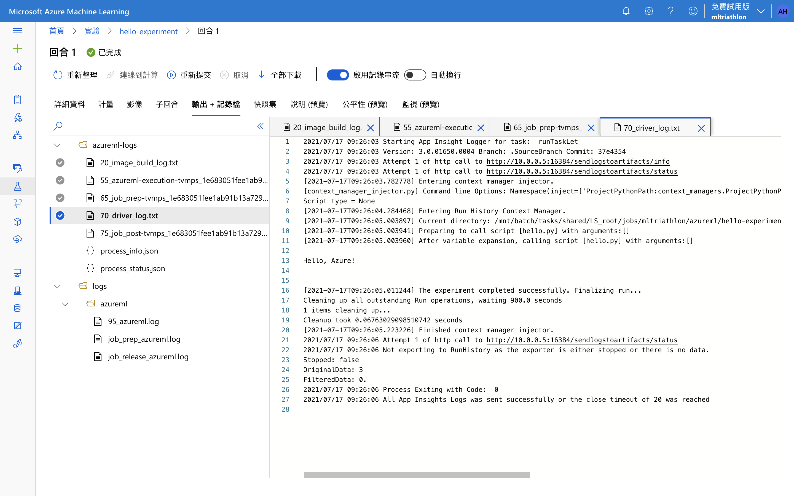
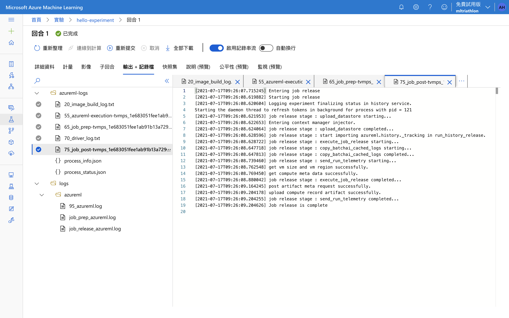

# Azure Machine Learning

---

## Azure 帳號申請

1. 進入https://login.microsoftonline.com/
2. 可以用 outlook 、 hotmail或其他email建立帳戶
3. 驗證email及真人身份
4. 進入https://azure.microsoft.com/
5. 按下*開始免費使用*
6. 填妥信用卡資訊
   - 免費使用階段不扣款，主動升級才會扣款
   - 一開始可免費使用30天，並有大約6100台幣的credit


----


## Azure CLI 安裝

- 官方文件：
  - https://docs.microsoft.com/zh-tw/cli/azure/install-azure-cli
- 在 Ubuntu 上安裝 Azure CLI

```
# 更新並安裝必要的套件
sudo apt-get update
sudo apt-get install ca-certificates \
curl apt-transport-https lsb-release gnupg

# 下載並安裝Microsoft signing key
curl -sL https://packages.microsoft.com/keys/microsoft.asc |
    gpg --dearmor |
    sudo tee /etc/apt/trusted.gpg.d/microsoft.gpg > /dev/null
```
---~

- 在 Ubuntu 上安裝 Azure CLI

```bash

# 新增Azure CLI software repository
AZ_REPO=$(lsb_release -cs)
echo "deb [arch=amd64] https://packages.microsoft.com/repos/azure-cli/ $AZ_REPO main" |
    sudo tee /etc/apt/sources.list.d/azure-cli.list

# 再次更新並安裝azure-cli
sudo apt-get update
sudo apt-get install azure-cli
```

----

## 登入Azure

```
az login
```

- 會出現一串代碼
- 進入https://aka.ms/devicelogin 
- 輸入上述代碼
- 選擇自己的帳戶登入

---

# Azure machine learning


              
---
                    

## Azure machine learning


- 建立工作區 
- 建立運算群組 
- 上傳檔案
- 執行實驗
  - 訓練模型
  - 註冊模型
- 部署服務
- 使用預測服務


              
---
                    

### 確認 Subscription ID 
#### (訂用帳戶 ID)

執行以下指令，取得 ID 和 Tenant ID
```
az account list
```


              
---
                    

### 建立工作區 

`create_workspace.py`
```
from azureml.core import Workspace

work_space = Workspace.create(
    name="mltibame",  # 工作區名稱
    subscription_id="Your subscription ID",  
    resource_group="Tibame",  # 資源群組名稱
    create_resource_group=True,
    location="eastus2",  
    # example: 'eastus2', or 'southeastasia'.
)

# write out the workspace details to the file: 
# .azureml/config.json
work_space.write_config(path=".azureml")

```


              
---
                    
### 建立工作區 


</img>

              
---
                    

### 建立運算群組


`create_compute.py`
```
from azureml.core import Workspace
from azureml.core.compute import ComputeTarget, AmlCompute
from azureml.core.compute_target import ComputeTargetException

# 建立工作區後，可以從 .azureml/config.json 讀取工作區資訊
work_space = Workspace.from_config()
```


              
---
                    

### 建立運算群組

`create_compute.py`
```
# 確認運算群組是否存在，否則直接建立運算群組
cpu_cluster_name = "cpu-cluster"
try:
    cpu_cluster = ComputeTarget(
      workspace=work_space, name=cpu_cluster_name)
    print("Found existing cluster, use it.")
except ComputeTargetException:
    compute_config = AmlCompute.provisioning_configuration(
        vm_size="STANDARD_D2_V2", max_nodes=4, 
        idle_seconds_before_scaledown=2400
    )
    cpu_cluster = ComputeTarget.create(
      work_space, cpu_cluster_name, compute_config)
cpu_cluster.wait_for_completion(show_output=True)
```

---

在`workspace`的頁面左側，可以找到`計算`，點進去之後可以看到剛剛建立的計算叢集。


              
---
                    

### 簡易測試
`hello.py`
```
print("Hello, Azure!")
```
- 執行實驗時，需要兩個script
  1. 一個在 Workspace 利用運算群組執行 `hello.py`
  2. 另一個 script `run_experiment.py` 在本機執行，使 Workspace 開始執行上述的 script


              
---
                    

### 簡易測試

`run_experiment.py`
```
from azureml.core import (
  Workspace, Experiment, ScriptRunConfig)
work_space = Workspace.from_config()
# 建立實驗
experiment = Experiment(
  workspace=work_space, name="hello-experiment")
config = ScriptRunConfig(
    source_directory=".",  # code放在哪個資料夾
    script="hello.py",  # 要上傳的code
    compute_target="cpu-cluster"
)
run = experiment.submit(config)
aml_url = run.get_portal_url()
print(aml_url) # 此連結可以看到 log
run.wait_for_completion(show_output=True) # 過程中的紀錄都會列出
```


---


準備好上述程式碼後，我們就能執行：

```bash
python3.7 run_experiment.py
```

---

執行之後，程式碼會把程式碼上傳執行。執行的時間大概要十幾分鐘左右，這時候你會想，為什麼要這麼久？因為......
- Azure 會從 build docker image 開始，build 完，然後再推到 Azure Container Registry- ACR 存放，這一步應該就是最花時間的步驟了。到`workspace`，進入`實驗`（下圖中，左側 ***燒杯*** 圖示）中查看`輸出 + 紀錄檔`，可以看到`20_image_build_log.txt`，這檔案紀錄上述過程。

---
- 接著，會把 dcoker image 拉到虛擬機器中展開成 container（記錄在`55_azureml-excution-tvmp_xxxxx.txt`）。

---

- 然後，把需要執行的程式碼放入 container 之中（記錄在`65_jobp_prep-tvmp_xxxxx.txt`）。

---
- 終於可以執行`print("Hello Azure!")`了。如果上傳的程式碼出錯，也可以從這裡的紀錄發現錯誤訊息。通常會出問題的地方，多半是在使用者想要執行的程式碼上，所以可以透過觀察 `70_driver_log.txt` 發現問題所在。

---

- 最後結束實驗，把運算資源釋放出來。

              
---
                    

### 上傳檔案

- MNIST handwritten digits Database 
  - http://yann.lecun.com/exdb/mnist/
  - Image of 28 * 28 pixles
  - Binary data
  - The labels values are 0 to 9
  - Training data: 60000 images
  - Testing data: 10000 images 


              
---
                    

### 上傳檔案

`upload_file.py`

```
import argparse
from azureml.core import Workspace, Dataset
def parse_args():
    parser = argparse.ArgumentParser()
# 在本機的資料夾
    parser.add_argument(
      "-f", "--folder", help="file folder", type=str) 
# 上傳到 datastore 的資料夾位置
    parser.add_argument(
        "-t", "--target_path", 
        help="file folder in datastore", type=str)
    parser.add_argument(
      "-n", "--dataname", help="name of dataset", type=str)
    args = parser.parse_args()
    return args
```

              
---
                    

### 上傳檔案

`upload_file.py`

```
work_space = Workspace.from_config()
args = parse_args()
datastore = work_space.get_default_datastore()
datastore.upload(
  src_dir=args.folder, 
  target_path=args.target_path,
  overwrite=True)
dataset = Dataset.File.from_files(
  path=(datastore, args.target_path))
dataset.register(work_space, name=args.dataname)
```

              
---
                    

### 上傳檔案

</img>


              
---
                    

### 執行實驗

- 在 Workspace 上執行 `train_keras.py`
- 在本機執行 `run_experiment_training.py`


              
---
                    

### 執行實驗

`train_keras.py`
```
# 讀 MNIST 圖檔
def load_image(path):
    f = gzip.open(path, "r")
    image_size = 28
# 前面的16位元是檔案的描述，第17位元開始才是圖檔
    f.read(16)
    buf = f.read()
    data = np.frombuffer(
      buf, dtype=np.uint8).astype(np.float32)
    data = data.reshape(
      int(data.shape[0] / 28 / 28), image_size, image_size, 1)
    f.close()
    return data
```

              
---
                    

### 執行實驗

`train_keras.py`
```
# 讀 MNIST label
def load_label(path):
    """
    Load label
    """
    f_p = gzip.open(path, "r")
# 前面的8位元是檔案的描述，第9位元開始才是label
    f_p.read(8)
    buf = f_p.read()
    data = np.frombuffer(
      buf, dtype=np.uint8).astype(np.int8)
    f_p.close()
    return data
```

              
---
                    

### 執行實驗
`train_keras.py`
```
def parse_args():
    """
    Parse Arguments
    """
    parser = argparse.ArgumentParser()
# 在 Azure ML 放data的資料夾
    parser.add_argument(
      "--data_folder", type=str, 
      help="Path to the training data")
# 為了 Tensorboard，在 Azure ML 放log的資料夾
    parser.add_argument(
        "--log_folder", type=str, 
        help="Path to the log", default="./logs")
    args = parser.parse_args()
    return args
```


              
---
                    

### 執行實驗

`train_keras.py`
```
args = parse_args()
# 取得執行實驗時的當下狀態
run = Run.get_context()
# Load mnist data
train_image = load_image(
    os.path.join(args.data_folder, 
    "train-images-idx3-ubyte.gz")
)
train_label = load_label(
    os.path.join(args.data_folder, 
    "train-labels-idx1-ubyte.gz")
)
# Normalize 到 0 ~ 1
train_image /= 255
train_label = to_categorical(train_label)
```

              
---
                    
### 執行實驗

`train_keras.py`
```
# LeNet

input_layer = Input(shape=(28, 28, 1))
layers = Conv2D(
  filters=6, kernel_size=(5, 5), 
  activation="tanh")(input_layer)
layers = MaxPooling2D(pool_size=(2, 2))(layers)
layers = Conv2D(
  filters=16, kernel_size=(5, 5),
  activation="tanh")(layers)
layers = MaxPooling2D(pool_size=(2, 2))(layers)
layers = Flatten()(layers)
layers = Dense(120, activation="tanh")(layers)
layers = Dense(84, activation="tanh")(layers)
output = Dense(10, activation="softmax")(layers)
```

              
---
                    
### 執行實驗

`train_keras.py`
```
# LeNet

model = Model(inputs=input_layer, outputs=output)
model.compile(
    optimizer="adam", loss="categorical_crossentropy", 
    metrics=["accuracy"]
)
```

              
---
                    

### 執行實驗


</img> 


              
---
                    

### 執行實驗

`train_keras.py`
```
# Tensorboard- 觀察訓練過程，把觀察值記錄在 Log Folder
tb_callback = TensorBoard(
    log_dir=args.log_folder,
    histogram_freq=0,
    write_graph=True,
    write_images=True,
    embeddings_freq=0,
    embeddings_layer_names=None,
    embeddings_metadata=None,
)
```

              
---
                    
### 執行實驗

`train_keras.py`
```
# train the network- 把訓練過程中的觀察值記錄下來
history_callback = model.fit(
    train_image,
    train_label,
    epochs=10,
    validation_split=0.2,
    batch_size=10,
    callbacks=[tb_callback],
)
```

              
---
                    
### 執行實驗

`train_keras.py`

```
# ouput log- 把觀察值傳給 Workspace
run.log_list("train_loss", history_callback.history["loss"])
run.log_list("train_accuracy", history_callback.history["accuracy"])
run.log_list("val_loss", history_callback.history["val_loss"])
run.log_list("val_accuracy", history_callback.history["val_accuracy"])

print("Finished Training")
# 模型只能放在 outputs 資料夾
model.save("outputs/keras_lenet.h5")
print("Saved Model")
```


              
---
                    

### 執行實驗
`run_experiment_training.py`
```
import azureml
from azureml.core import (
  ScriptRunConfig, Dataset, 
  Workspace, Experiment, Environment)
from azureml.core.conda_dependencies import CondaDependencies
from azureml.core.model import Model
work_space = Workspace.from_config()

# 設定 dataset folder
datastore = work_space.get_default_datastore()
dataset = Dataset.File.from_files(
  path=(datastore, "datasets/mnist"))

```

              
---
                    
### 執行實驗
`run_experiment_training.py`
```
# 設定用來訓練模型的實驗
experiment = Experiment(
  workspace=work_space, name="keras-lenet-train")
# 每次上傳code時， Workspace 會跟本機的資料夾同步
# 若本機的資料夾檔案太大，可做以下設定，最多 2 Gb 
azureml._restclient.snapshots_client.SNAPSHOT_MAX_SIZE_BYTES=\
 2000000000
config = ScriptRunConfig(
    source_directory=".",
    script="train_keras.py",
    compute_target="cpu-cluster",
    arguments=[
        "--data_path",
        dataset.as_named_input("input").as_mount()])
```


              
---
                    
### 執行實驗
`run_experiment_training.py`
```

# 設定環境：安裝所需套件
environment = Environment("keras-environment")
environment.python.conda_dependencies = \
CondaDependencies.create(
    pip_packages=[
      "azureml-defaults", 
      "numpy", 
      "tensorflow==2.3.1"]
)
config.run_config.environment = environment

```


              
---
                    

### 執行實驗

`run_experiment_training.py`
```
# 執行實驗，開始訓練模型
run = experiment.submit(config)
aml_url = run.get_portal_url()
print(aml_url)

# tensorboard 呈現
tboard = Tensorboard([run])
tboard.start(start_browser=True)
run.wait_for_completion(show_output=True)
tboard.stop()
```


              
---
                    

### 執行實驗
`run_experiment_training.py`
```
# 註冊模型
metrics = run.get_metrics()
run.register_model(
    model_name="keras_mnist",
    tags={"data": "mnist", "model": "classification"},
    model_path="outputs/keras_lenet.h5",
    model_framework=Model.Framework.TENSORFLOW,
    model_framework_version="2.3.1",
# 紀錄最後一個epoch的觀察值
    properties={
        "train_loss": metrics["train_loss"][-1],
        "train_accuracy": metrics["train_accuracy"][-1],
        "val_loss": metrics["val_loss"][-1],
        "val_accuracy": metrics["val_accuracy"][-1]})
```

              
---
                    

### 執行實驗

#### Tensorboard

|  |  |
| ------------------- | ------------------- |

              
---
                    
### 部署服務

- 部署服務時，需要兩個script
  1. 一個在 Workspace 利用運算群組執行 `score_keras.py`
  2. 另一個 script `deploy_service.py` 在本機執行，將預測的服務在 Workspace 部署


              
---
                    


### 部署服務

`score_keras.py`
```
import os
import json
import numpy as np
from tensorflow.keras.models import load_model
def init(): 
    global model
# 從預設位置讀取模型
    model_path = os.path.join(
      os.getenv("AZUREML_MODEL_DIR"), "keras_lenet.h5")
    model = load_model(model_path)
def run(raw_data): 
    data = json.loads(raw_data)["data"]
    data = np.array(data).reshape((1, 28, 28, 1))
    y_hat = model.predict(data)
    return float(np.argmax(y_hat))
```


              
---
                    

### 部署服務

`deploy_service.py`

```
import numpy as np
from azureml.core import Environment, Model, Workspace
from azureml.core.conda_dependencies import CondaDependencies
from azureml.core.model import InferenceConfig
from azureml.core.webservice import AciWebservice

work_space = Workspace.from_config()
# 設定服務環境
environment = Environment("keras-service-environment")
environment.python.conda_dependencies = \
CondaDependencies.create(
   python_version="3.7.7",
   pip_packages=[
     "azureml-defaults", "numpy", "tensorflow==2.3.1"])

```


              
---
                    

### 部署服務

`deploy_service.py`

```
model = Model(work_space, "keras_mnist")
model_list = model.list(work_space)
# 找出 Validation Accuracy 最高的模型
validation_accuracy = []
version = []
for i in model_list:
   validation_accuracy.append(
     float(i.properties["val_accuracy"]))
   version.append(i.version)
model = Model(
   work_space, "keras_mnist", 
   version=version[np.argmax(validation_accuracy)]
)
```


              
---
                    

### 部署服務

`deploy_service.py`

```
service_name = "keras-mnist-service"
inference_config = InferenceConfig(
    entry_script="score_keras.py", environment=environment
)
# 設定運算時需要的 CPU 和 記憶體
aci_config = AciWebservice.deploy_configuration(
  cpu_cores=1, memory_gb=1)
```


              
---
                    
### 部署服務
`deploy_service.py`

```
# 部署服務
service = Model.deploy(
    workspace=work_space,
    name=service_name,
    models=[model],
    inference_config=inference_config,
    deployment_config=aci_config,
    overwrite=True,)
service.wait_for_deployment(show_output=True)
print(service.get_logs()) # 部署失敗的話，可以檢查 log
print(work_space.webservices) # 確認已部署服務
 ```

              
---
                    

### 使用預測服務


`predict_mnist_azml.py`
```
import argparse
import gzip
import json
import os
import requests
import numpy as np
from PIL import Image
args = parse_args()
# 讀取 MNIST test images
test_image = load_image(os.path.join(
  args.data_folder, "t10k-images-idx3-ubyte.gz"))
test_image /= 255
# 隨機挑選一張圖
testing_num = np.random.randint(
  low=0, high=len(test_image) - 1)
```


              
---
                    
### 使用預測服務

`predict_mnist_azml.py`
```
# 轉換浮點數成 JSON 字串
data = {"data": test_image[testing_num].tolist()}
input_data = json.dumps(data)
# Set the content type
headers = {"Content-Type": "application/json"}
# 透過 POST 訪問之前部署的服務
resp = requests.post(
  args.endpoint_url, input_data, headers=headers)
ans = resp.text.replace("[", "").replace("]", "").split(", ")
ans = int(float(ans[0]))
print("The answer is {}".format(ans))
array = np.reshape(test_image[testing_num] * 255, (28, 28))
img = Image.fromarray(array)
img.show()
```


              
---
                    

### 使用預測服務

`predict_mnist_azml.py`
```
# 如果要存成圖檔，必須先轉成 RGB 格式
img = img.convert("RGB")
img.save("output.png")

```


---

## 參考資料
- Azure Machine Learning documentation: https://tinyurl.com/yxzjslm5
  - Jupyter Notebook: https://tinyurl.com/r934vbp
  - Automated ML: https://tinyurl.com/y4koj4f2
  - Model Management: https://tinyurl.com/tf8w7cn

